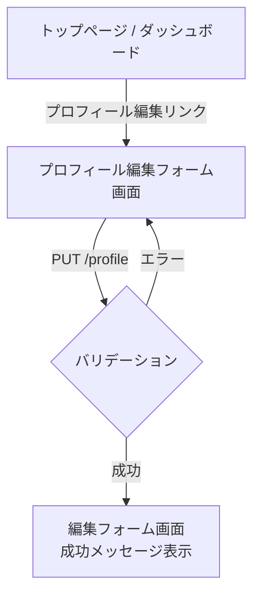
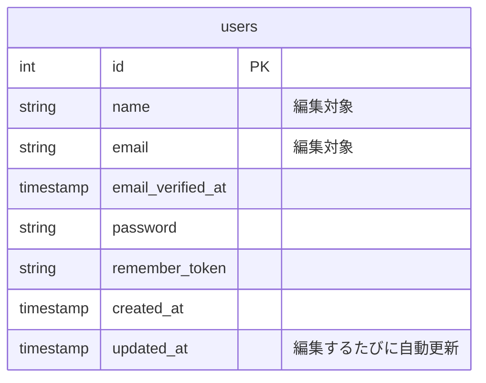

# プロフィール編集機能 - 設計書

## 1. 要件整理

- ログイン中のユーザーが、自分の「名前」と「メールアドレス」を編集できる
- 更新に成功したら、成功メッセージを表示する
- 入力内容に誤りがあれば、エラーメッセージを表示して再入力を促す

## 2. 入力項目

| 項目                  | 型                 | 必須 |
| --------------------- | ------------------ | ---- |
| 名前(name)            | 文字列             | ○    |
| メールアドレス(email) | 文字列(メール形式) | ○    |

## 3. バリデーション

| 項目  | ルール                                                                      |
| ----- | --------------------------------------------------------------------------- |
| name  | 必須、100文字以内                                                           |
| email | 必須、メール形式、100文字以内、他のユーザーと重複しないこと(自分自身は除く) |

補足: `email`の重複チェックが重要。`users.email`には既にユニーク制約(`uq_users_email`)があるため最終的な保証はDB側にあるが、アプリ側でも事前チェックしてユーザーに分かりやすいエラーメッセージを返す。

## 4. 権限

- ログイン中の本人だけが、自分のプロフィールを編集できる
- 他人のプロフィールは編集できない(他人のIDを指定してアクセスしても拒否される)
- 未ログインの場合は、ログイン画面にリダイレクトする

## 5. 画面遷移図



## 6. 簡易ER図の更新

Laravel標準の`users`テーブルには既に`updated_at`列が含まれており、この機能のために新しく列を追加する必要はない。



## 7. API仕様(REST形式)

| メソッド | URI             | 用途               | 認証 |
| -------- | --------------- | ------------------ | ---- |
| GET      | `/profile/edit` | 編集フォームを表示 | 必須 |
| PUT      | `/profile`      | プロフィールを更新 | 必須 |

### PUT /profile

リクエスト例:

```json
{
  "name": "山田太郎",
  "email": "yamada@example.com"
}
```

- 成功時: `302 Redirect` → `/profile/edit`(セッションに成功メッセージを保持)
- バリデーションエラー時: `302 Redirect` → 元の画面(エラーメッセージ・入力値を保持)

補足: RESTの考え方では「新規作成」は`POST`、「既存データの更新」は`PUT`(全体更新)または`PATCH`(部分更新)を使うのが基本。今回は名前・メール両方を送るため`PUT`を使用する。

## 実装方針(簡易版)

現時点でログイン機能(認証)が未実装のため、実装フェーズでは以下のように簡易化する:

- 「ログイン中の本人」の代わりに、固定のユーザー(`id=3`)を編集対象とする
- 認証チェック・リダイレクトは実装しない(将来ログイン機能を追加した際に本格対応する)
